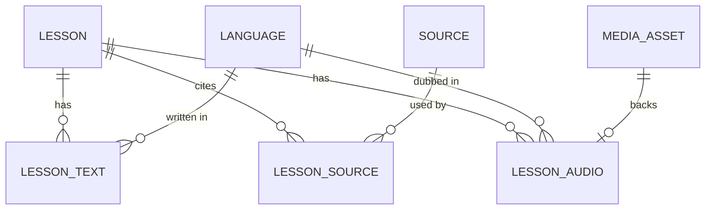
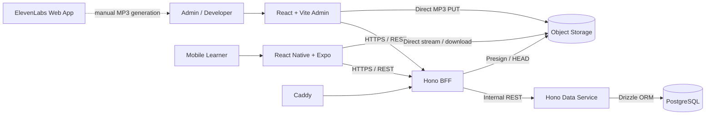
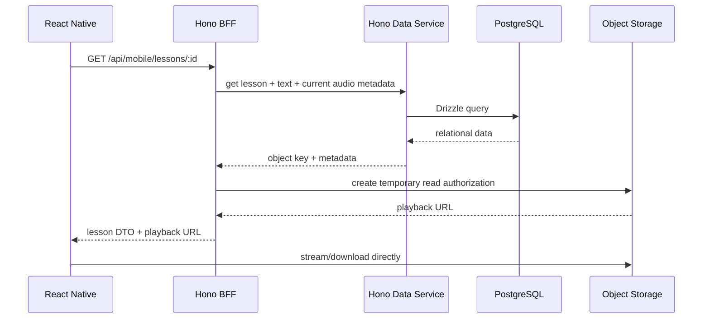

# Danish Citizenship Learning App — PoC Context

> Canonical domain and architecture context for Codex.
>
> **Phase:** Proof of Concept
> **Backend:** Hono + TypeScript for BFF and Data Service
> **ORM:** Drizzle ORM + Drizzle Kit
> **Database:** PostgreSQL
> **Deployment:** Docker Compose on Hetzner CX23
> **Media:** AWS S3
> **PoC TTS:** MP3 generated manually in the ElevenLabs web app

---

## 1. Product purpose

The application helps a Thai-speaking learner prepare for the Danish citizenship exam.

The primary learner is comfortable with a smartphone but not with desktop-style software, and prefers listening while working. Product priorities are therefore:

- simple mobile UX,
- Thai explanations,
- audio-first lessons,
- background playback,
- Danish study content,
- and later Danish quiz questions with Danish, English, and Thai answer/explanation support.

The project is also a portfolio project demonstrating TypeScript backend development, mobile development, relational modeling, object storage, Docker/IaaS deployment, cloud integration, and CI/CD.

The real user's usability has priority over adding technologies only for portfolio value.

---

## 2. PoC success path

```text
Create Lesson
    ↓
Create localized Lesson Text
    ↓
Associate one or more reusable Sources
    ↓
Generate Thai MP3 manually in ElevenLabs web app
    ↓
Select MP3 in admin web
    ↓
Request temporary upload authorization from Hono BFF
    ↓
Browser uploads MP3 directly to object storage
    ↓
BFF validates the stored object
    ↓
Hono Data Service persists Media Asset metadata with Drizzle
    ↓
Lesson Audio associates Lesson + Language + Media Asset
    ↓
React Native requests Lesson
    ↓
BFF returns Lesson data + temporary playback URL
    ↓
React Native streams/downloads directly from object storage
```

The PoC is complete when this vertical slice works reliably in the deployed environment.

---

## 3. Explicitly out of scope

Do not add these unless they become necessary for the PoC vertical slice:

- automated ElevenLabs API generation,
- a separate ElevenLabs microservice,
- payments/subscriptions,
- full learner account management,
- server-synchronized progress,
- quiz-attempt history,
- recommendation systems,
- RabbitMQ or another broker,
- Kubernetes,
- separate deployed Web BFF and Mobile BFF services,
- video transcoding,
- active multi-cloud storage replication.

---

# 4. Ubiquitous language

Use these terms consistently in code, database names, APIs, issues, specs, and documentation.

## Lesson

A language-independent unit of citizenship-study content.

Contains structural data such as chapter, version, status, and timestamps.

A Lesson is not translated text and is not an audio file.

## Lesson Text

A localized textual representation of a Lesson in one Language.

Identity:

```text
(lesson_id, language_code)
```

Contains:

```text
title
content
```

## Language

A supported language lookup value.

Initial values:

```text
da → Danish
en → English
th → Thai
```

## Source

A canonical external study source, for example an official PDF or government webpage.

A Source may support multiple Lessons.

For the PoC, a Source is identified by its canonical URL. The URL is a trimmed,
absolute HTTP(S) URL and must be unique by exact stored value. Recognizing two
textually different URLs as the same Source remains an admin responsibility.

Do not duplicate the same canonical Source row for each Lesson.

## Lesson Source

The association between a Lesson and a Source.

It resolves:

```text
Lesson M:N Source
```

It stores relationship-specific reference information such as page ranges.

## Media Asset

Metadata identifying one binary object in object storage.

The actual MP3 bytes are not stored in PostgreSQL.

Stable identity uses:

```text
storage_provider
storage_container
object_key
```

Temporary presigned URLs are not Media Asset identity.

## Lesson Audio

A versioned audio rendition associated with:

```text
Lesson + Language + Media Asset
```

A `PUBLISHED` Lesson may receive its first Lesson Audio or promote a new audio
version without creating a new Lesson version. This does not permit changes to
the Lesson's structure, Lesson Texts, or Lesson Source associations. An
`ARCHIVED` Lesson cannot receive or promote Lesson Audio. Completing the same
Media Asset more than once returns the existing Lesson Audio rather than
creating another version.

## Upload Intent

Short-lived authorization that lets the admin browser upload one specific object directly to object storage.

For the PoC it accepts one `.mp3` file declared as `audio/mpeg`, from 1 byte
through 50 MiB, and expires after 15 minutes.

## Playback URL

Short-lived, read-only access to one Media Asset.

It is generated at runtime, expires after one hour, and is never persisted.

## BFF

The public Hono Backend-for-Frontend.

Owns client orchestration and object-storage authorization, but not PostgreSQL.

## Data Service

The internal Hono service that owns Drizzle, relational persistence, constraints, and migrations.

Only this service directly accesses PostgreSQL.

---

# 5. Current PoC relationships

```text
Lesson   1 ───── 0..* Lesson Text
Language 1 ───── 0..* Lesson Text

Lesson 1 ─────── 0..* Lesson Source
Source 1 ─────── 0..* Lesson Source

Therefore:
Lesson M:N Source

Lesson   1 ───── 0..* Lesson Audio
Language 1 ───── 0..* Lesson Audio

Lesson Audio ─── Media Asset
```



---

# 6. PoC EER

The visual EER intentionally excludes FK columns for readability.

**Drizzle must still define all required foreign keys and constraints.**

Current entities:

1. `lesson`
2. `lesson_text`
3. `language`
4. `source`
5. `lesson_source`
6. `media_asset`
7. `lesson_audio`

Surrogate `id` columns use PostgreSQL generated identity integers. The PoC has
one database writer and does not require distributed or offline ID generation.

## `lesson`

```text
lesson
- id [PK]
- chapter
- version
- status
- created_at
- updated_at
```

Constraints:

```text
chapter > 0
version > 0
UNIQUE(chapter, version)
```

Statuses:

```text
DRAFT
PUBLISHED
ARCHIVED
```

The PostgreSQL enum is named `lesson_status`.

Multiple draft and archived versions may exist for a chapter, but at most one
version may be `PUBLISHED`. PostgreSQL enforces this with a partial unique index
on `chapter` where `status = 'PUBLISHED'`.

New Lessons always begin as `DRAFT`. Allowed lifecycle transitions are:

```text
DRAFT -> PUBLISHED
DRAFT -> ARCHIVED
PUBLISHED -> ARCHIVED
```

`ARCHIVED` is terminal. Lesson structure, Lesson Texts, and Lesson Source
associations may be changed only while the Lesson is `DRAFT`. After it leaves
`DRAFT`, corrections require a new Lesson version rather than editing the
published or archived version in place. Lesson Audio is independently
versioned: a `PUBLISHED` Lesson may receive or replace its current audio, but an
`ARCHIVED` Lesson may not.

Both `created_at` and `updated_at` default to the database clock on insertion.
`updated_at` represents the last change to the complete Lesson aggregate. The
Data Service explicitly advances it when Lesson structure or status, a Lesson
Text, a Lesson Source association, or the current Lesson Audio changes; no
database trigger maintains it. Creating a `PENDING` Media Asset alone does not
advance the Lesson timestamp. Final draft edits and the transition to
`PUBLISHED` may be submitted as one command, and the Data Service applies them
atomically.

## `language`

```text
language
- code [PK]
- name
```

Initial rows:

```text
da | Danish
en | English
th | Thai
```

`code` stores a BCP 47-compatible Language code up to 35 characters. The
Language table controls which codes the application supports; do not replace it
with a closed database enum.

## `lesson_text`

```text
lesson_text
- lesson_id [PPK]
- language_code [PPK]
- title
- content
```

Primary key:

```text
(lesson_id, language_code)
```

Implementation FKs:

```text
lesson_id → lesson.id
language_code → language.code
```

Functional dependency:

```text
(lesson_id, language_code) → title, content
```

`title` and `content` are required and must contain at least one non-whitespace
character.

## `source`

```text
source
- id [PK]
- url
- published_at [nullable]
```

Some Sources, particularly government webpages, have no reliable publication
date. Store `published_at` when it is known and use `NULL` otherwise.

`source` is canonical and reusable.

Do **not** put `lesson_id` in this table.

The relationship is owned by `lesson_source`.

Constraints:

```text
UNIQUE(url)
```

The Data Service validates that `url` is an absolute HTTP(S) URL after trimming
surrounding whitespace.

Possible future fields, only when required:

```text
title
publisher
retrieved_at
```

## `lesson_source`

Current EER:

```text
lesson_source
- lesson_id [PPK]
- source_id [PPK]
- page_from
- page_to
- section_reference
```

Primary key:

```text
(lesson_id, source_id)
```

Implementation FKs:

```text
lesson_id → lesson.id
source_id → source.id
```

This resolves the M:N relationship.

Example:

```text
Source 1 = official citizenship-study PDF

Lesson 1 → Source 1 → pages 10–15
Lesson 2 → Source 1 → pages 16–22
Lesson 3 → Source 1 → pages 40–44
```

Relationship-specific page references belong on `lesson_source`, not `source`.

Constraints:

```text
page_from IS NULL OR page_from > 0
page_to   IS NULL OR page_to > 0

when both exist:
page_to >= page_from
```

`page_from`, `page_to`, and `section_reference` are nullable. All three may be
absent when the entire Source supports the Lesson.

## `media_asset`

```text
media_asset
- id [PK]
- storage_provider
- storage_container
- object_key
- original_filename
- content_type
- size_bytes
- duration_ms
- status
- created_at
- uploaded_at
```

`created_at`, `content_type`, and `size_bytes` are required when the Media Asset
is created. `uploaded_at` remains `NULL` while it is `PENDING` and is set only
after successful object validation. `duration_ms` is optional and remains
`NULL` in Stage 3 because the BFF does not inspect MP3 bytes or trust a
client-supplied duration.

Constraints require `size_bytes > 0`, `duration_ms > 0` when present, and a
non-blank `content_type`. The database does not restrict Media Assets to one
specific MIME type.

Recommended uniqueness:

```text
UNIQUE(storage_provider, storage_container, object_key)
```

Use `BIGINT` for `size_bytes`.

Suggested statuses:

```text
PENDING
READY
FAILED
DELETED
```

`FAILED` is terminal in Stage 3 and requires a new Upload Intent. Superseded
`READY` Media Assets and their Lesson Audio rows remain as immutable history.
Stage 3 does not implement `DELETED` behavior.

The PostgreSQL enum is named `media_asset_status`; do not use the overloaded
name `status` for the enum type.

Never store:

```text
MP3 bytes
permanent cloud credentials
temporary presigned URLs
```

## `lesson_audio`

The visual EER omits FKs.

Conceptual fields:

```text
lesson_audio
- id [PK]
- audio_version
- is_current
- created_at
```

Implementation requires:

```text
lesson_id [FK]
language_code [FK]
media_asset_id [FK]
```

`(lesson_id, language_code)` references the corresponding composite key on
`lesson_text`. Audio therefore cannot exist in a Language until the localized
Lesson Text exists.

Canonical shape:

```text
lesson_audio
- id [PK]
- lesson_id [FK]
- language_code [FK]
- media_asset_id [FK]
- audio_version
- is_current
- created_at
```

Recommended constraints:

```text
UNIQUE(lesson_id, language_code, audio_version)
UNIQUE(media_asset_id)
CHECK(audio_version > 0)
```

Recommended PostgreSQL partial unique index:

```sql
CREATE UNIQUE INDEX ux_lesson_audio_current
ON lesson_audio (lesson_id, language_code)
WHERE is_current = TRUE;
```

This guarantees at most one current audio version per Lesson + Language.

---

# 7. Normalization

The intended PoC schema is at least 3NF under the current domain rules.

## 1NF

Attributes are atomic. No lists of translations, URLs, or object keys are stored in one relational column.

## 2NF

Composite-key tables depend on their whole key.

```text
(lesson_id, language_code)
    → lesson_text.title
    → lesson_text.content
```

```text
(lesson_id, source_id)
    → lesson_source.page_from
    → lesson_source.page_to
    → lesson_source.section_reference
```

## 3NF

Non-key attributes describe the entity identified by the key rather than another non-key attribute.

The `lesson_source` bridge avoids duplicating canonical Source rows and correctly represents Source reuse across Lessons.

---

# 8. Resolved decisions and flagged ambiguities

## 8.1 Source section references

`section_reference` is the canonical term for a heading, clause, or section
within a Source. Do not use `session_reference`.

## 8.2 Lesson Audio FK strategy

Lesson Audio uses a composite foreign key:

```text
(lesson_id, language_code)
    → lesson_text(lesson_id, language_code)
```

This guarantees that audio cannot exist for a Language unless the corresponding
localized Lesson Text exists.

## 8.3 Media Asset ↔ Lesson Audio during upload

A `PENDING` Media Asset may exist without a Lesson Audio. The relationship is
`Media Asset 1 → 0..1 Lesson Audio`, and Lesson Audio is created only after the
stored object has been validated and the Media Asset is `READY`.

## 8.4 Object-storage provider

The PoC uses AWS S3 in `eu-north-1`. Do not build Azure Blob Storage support or
dual-provider synchronization.

## 8.5 Audio for published Lessons

A `PUBLISHED` Lesson may receive its first Lesson Audio or atomically promote a
new current audio version. Lesson Audio has its own version history, so this
does not reopen the Lesson or create a new Lesson version. Promotion advances
the Lesson's `updated_at`; creating a `PENDING` Media Asset does not. An
`ARCHIVED` Lesson cannot receive or promote Lesson Audio.

## 8.6 Playback authorization

Mobile Lesson detail includes current Lesson Audio metadata and a freshly
generated Playback URL. Playback does not require a separate API request, and
the response uses `Cache-Control: no-store`. When no current `READY` rendition
exists, `audio` is `null`. The BFF generates playback authorization without an
additional S3 metadata request and returns its expiry with the URL.

## 8.7 Upload acceptance and validation

The PoC accepts filenames ending in `.mp3`, declared as `audio/mpeg`, with a
size from 1 byte through 50 MiB. After upload, the BFF checks S3 object metadata
for the expected content type and exact declared size. It does not download or
inspect MP3 bytes. The signed upload requires `If-None-Match: *`, and the bucket
policy enforces conditional writes so a generated object key can be written
only once. The signature also binds the declared exact `Content-Length` and
`Content-Type`. The browser tracer must prove those signed headers work before
Stage 3 is complete. The PoC does not enable S3 bucket versioning.

## 8.8 Upload completion semantics

Completion is idempotent per Media Asset. Repeating completion returns its
existing Lesson Audio and never creates another audio version. When distinct
uploads for the same Lesson and Language complete, each receives the next
audio version atomically and the last successful completion becomes current.

For the PoC, the authenticated admin resubmits `lessonId` and `languageCode` at
completion. The BFF revalidates them, and the first successful completion binds
the Media Asset. The Upload Intent target is not persisted separately; add
durable intent binding if multiple or untrusted admins make resubmission unsafe.

Completion requires a matching Lesson Text and a Lesson in `DRAFT` or
`PUBLISHED`. A missing target returns `404`; a missing Lesson Text or an
`ARCHIVED` Lesson returns `409`. These target failures leave the Media Asset
`PENDING` so the admin can correct and retry.

After the BFF validates S3 metadata, one internal Data Service command uses one
PostgreSQL transaction to mark the Media Asset `READY`, allocate the next audio
version, demote the previous current version, create the new current Lesson
Audio, and advance the Lesson's `updated_at`. A transaction failure leaves the
object and `PENDING` row safe to retry.

Superseded `READY` objects and Lesson Audio rows remain as immutable history.
A `FAILED` Media Asset is terminal and requires a new Upload Intent. `DELETED`
behavior is outside Stage 3.

## 8.9 Storage verification

Automated tests use an injected fake storage implementation. One opt-in tracer
uses isolated `smoke/` objects in the existing S3 bucket and deletes the exact
objects it creates. The PoC does not add MinIO or a second bucket.

Required S3 configuration is validated at BFF startup, but readiness does not
make a network request to S3. Per-request storage failures and the live tracer
provide the operational signal.

## 8.10 Object keys and failed uploads

Final audio object keys use `audio/{random UUID}.mp3`; they contain no Lesson
ID, Language code, or original filename. Live-tracer keys use
`smoke/{random UUID}.mp3`.

A transient S3 error or missing object during completion leaves the Media Asset
`PENDING` and returns a retryable error. An exact-size or content-type mismatch
first marks the Media Asset `FAILED`, then attempts to delete the private object.
A deletion failure is logged and may leave an inert orphan, but invalid media
cannot become playable. Abandoned `PENDING` rows or objects are not cleaned up
automatically in the PoC; add cleanup when leakage becomes measurable.

## 8.11 S3 access boundary

The S3 bucket is private with public access blocked. Its CORS policy allows
`PUT` from the local Admin origin and, once known, the production Admin origin;
it uses no wildcard origins or unnecessary methods and headers. Its bucket
policy requires `If-None-Match` for object writes.

The BFF obtains temporary STS credentials through AWS IAM Roles Anywhere. A
private CA dedicated to this workload issues the application certificate,
whose subject CN remains `aws-iam-app` for the PoC cutover. The role trust
policy is restricted by both the exact Trust Anchor ARN and that certificate
CN.

The official `aws_signing_helper` runs inside the BFF container through
`credential_process` in a shared AWS profile. The AWS SDK uses its normal
credential provider chain and refresh behavior; the application contains no
custom credential-refresh logic and receives no permanent IAM access key. The
BFF uses a glibc-compatible Node base image for the helper, while the Data
Service remains Alpine and receives no AWS identity material. The BFF image
pins an official helper release and verifies its published checksum during the
build. BFF startup rejects legacy `AWS_ACCESS_KEY_ID` or
`AWS_SECRET_ACCESS_KEY` configuration so it cannot silently bypass the shared
Roles Anywhere profile.

The infrastructure repository commits only the public CA certificate at
`terraform/ez-dk-citizen/certs/ca.crt`. The workload certificate and private
key and shared AWS profile are provisioned on the host and bind-mounted
read-only at stable paths only into the BFF. The workload private key has mode
`0600` and is readable by the non-root BFF process. No CA private key, workload
private key, or private-key-bearing P12/PFX bundle is committed, baked into an
image, or managed by Terraform.

Because no repository-driven production deployment exists yet, the Roles
Anywhere cutover is verified with the production-like BFF container running
locally against the live S3 bucket. Verification requires the real signing
helper and mounted workload identity, rejection of static AWS access-key
variables, the opt-in live tracer, and identity evidence for the Roles Anywhere
role. The legacy IAM user may be retired only after that succeeds and the
agreed rollback window passes; VPS deployment remains a separate Stage 6
concern.

Storage logs include the request ID, operation, Media Asset ID, and AWS error or
request code. They never include presigned URLs or credentials. Stage 3 adds no
custom metrics or dashboards.

---

# 9. Architecture



---

# 10. Service boundaries

## Hono BFF

Public/client-facing backend.

Responsibilities:

- `/api/admin/*`,
- `/api/mobile/*`,
- auth boundary,
- request validation,
- response composition,
- object-storage SDK integration,
- upload-intent creation,
- temporary upload URL generation,
- temporary playback URL generation,
- object metadata validation,
- internal Data Service calls.

The BFF must not:

- import/use the Data Service database client,
- mutate PostgreSQL directly,
- proxy normal MP3 bytes through the VPS,
- expose cloud credentials.

## Hono Data Service

Internal-only persistence API.

Responsibilities:

- Drizzle schema,
- Drizzle relations,
- database queries,
- relational CRUD,
- constraints,
- migrations,
- internal validation.

Only this service connects directly to PostgreSQL.

```text
Client
  ↓
Hono BFF
  ↓ internal REST
Hono Data Service
  ↓ Drizzle
PostgreSQL
```

---

# 11. Object storage

Database identity remains provider-neutral:

```text
storage_provider
storage_container
object_key
```

PoC provider:

```text
AWS S3 (`eu-north-1`)
```

MP3 bytes should bypass the backend.

## Upload flow

```text
1. Admin chooses MP3.
2. Admin web sends metadata to BFF.
3. BFF validates the admin request.
4. BFF generates an opaque `audio/{random UUID}.mp3` object key.
5. BFF creates PENDING Media Asset via Data Service.
6. BFF generates short-lived upload authorization binding the declared exact
   `Content-Length`, `Content-Type: audio/mpeg`, and `If-None-Match: *`.
7. Browser PUTs directly to object storage.
8. Browser notifies BFF of completion.
9. BFF validates the object's exact content length and `audio/mpeg` content
   type through S3 object metadata.
10. BFF marks Media Asset READY via Data Service.
11. Lesson Audio association/version is created or updated.
```

Suggested route:

```http
POST /api/admin/media/upload-intents
```

Example request:

```json
{
  "lessonId": 12,
  "languageCode": "th",
  "originalFilename": "lesson-12-th-v2.mp3",
  "contentType": "audio/mpeg",
  "sizeBytes": 2450000
}
```

The object key must be server-generated.

## Playback flow



Never persist the temporary playback URL.

---

# 12. PoC tech stack

| Concern           | PoC choice                       |
| ----------------- | -------------------------------- |
| Admin frontend    | React + Vite                     |
| Mobile            | React Native + Expo              |
| Public backend    | Hono + TypeScript                |
| Data service      | Hono + TypeScript                |
| ORM               | Drizzle ORM                      |
| Migration tooling | Drizzle Kit                      |
| Database          | PostgreSQL                       |
| Object storage    | AWS S3                            |
| TTS for PoC       | ElevenLabs web app manually      |
| Future TTS        | ElevenLabs API                   |
| Runtime           | Node.js                          |
| Package manager   | pnpm                             |
| Hosting           | Hetzner CX23 VPS                 |
| Containers        | Docker + Docker Compose          |
| Reverse proxy     | Caddy                            |
| Admin hosting     | Cloudflare Pages                 |
| DNS               | Cloudflare                       |
| CI/CD             | GitHub Actions                   |
| Registry          | GHCR                             |
| VPS deployment    | SSH + Docker Compose             |

---

# 13. Suggested repository shape

Do not reorganize an existing repository merely to match this example.

```text
ez-dk-citizen/
├── apps/
│   ├── admin/          # React + Vite
│   ├── mobile/         # React Native + Expo
│   ├── bff/            # Hono + TypeScript
│   └── data/           # Hono + Drizzle
│
├── packages/
│   ├── api-contracts/
│   ├── shared-types/
│   └── tsconfig/
│
├── docs/
│   ├── adr/
│   └── architecture/
│
├── infrastructure/
│   ├── docker/
│   └── caddy/
│
├── .github/workflows/
├── CONTEXT.md
└── AGENTS.md
```

---

# 14. Drizzle ownership and migrations

The Hono Data Service owns the Drizzle schema.

The repository uses one root pnpm workspace declaring `apps/*`, one root
lockfile, and root scripts for Data Service development, build, schema
generation, migration, and tests.

Suggested layout:

```text
apps/data/
├── src/
│   ├── db/
│   │   ├── schema/
│   │   │   ├── lesson.ts
│   │   │   ├── lesson-text.ts
│   │   │   ├── language.ts
│   │   │   ├── source.ts
│   │   │   ├── lesson-source.ts
│   │   │   ├── media-asset.ts
│   │   │   └── lesson-audio.ts
│   │   ├── relations.ts
│   │   └── client.ts
│   └── routes/
└── drizzle.config.ts
```

Rules:

- define FKs and constraints in Drizzle schema,
- generate SQL migrations with Drizzle Kit,
- commit migrations,
- review generated SQL before production,
- use committed migrations for production,
- do not use schema push as the normal production migration mechanism,
- use database constraints for invariants that must never be violated,
- insert the required `da`, `en`, and `th` Language rows in the committed initial migration.

Local Compose includes `postgres`, a one-shot `migrate` service, and
`hono-data`. PostgreSQL must be healthy before migration starts, and the Data
Service starts only after migration completes successfully.

Local application runtime is container-first, as recorded in
[`ADR-0003`](../adr/0003-container-first-local-application-runtime.md).
`pnpm dev` runs Docker Compose Watch in the foreground. Compose starts
PostgreSQL, applies committed migrations, starts the Data Service, and starts
the BFF only after the Data Service is ready.

The base Compose file retains compiled services for reproducible integration
workflows. Its automatic local override selects development targets that run
`tsx watch`. Compose Watch synchronizes only application source and migration
files; dependency manifests, shared contracts, lockfiles, and Dockerfiles
trigger image rebuilds. Host `node_modules` and `dist` directories are never
synchronized into containers.

Tests, typechecking, workspace builds, and Drizzle migration generation remain
host-run. Initial startup applies committed migrations through the one-shot
migration service; after generating a migration, `pnpm db:migrate` applies it
inside the running development Data Service container. Integration tests use
the base Compose file with an isolated project, database, and deterministic
cleanup rather than reusing development state.

Compose receives `POSTGRES_DB`, `POSTGRES_USER`, and `POSTGRES_PASSWORD`, then
constructs the internal `DATABASE_URL`. Drizzle consumes only `DATABASE_URL`.
Local Compose supplies clearly labeled development-only defaults, so
`pnpm dev` works without an `.env` file. Placeholder values live in a tracked
`.env.example`, ignored `.env` files may override local defaults, and
application startup outside local Compose still requires explicit credentials.

Constraint tests run against real PostgreSQL after applying migrations to a
fresh database. They exercise invalid inserts and deletes rather than merely
inspecting generated SQL.

Define bidirectional Drizzle relationship metadata for all seven tables in
addition to the SQL foreign keys, and exercise relational queries in the same
PostgreSQL integration suite.

Development flow:

```text
pnpm dev
    ↓
Compose Watch starts PostgreSQL → migrations → Data Service → BFF
    ↓
Edit application source
    ↓
Compose syncs source; tsx reloads the affected service
```

Schema change flow:

```text
Change Drizzle schema on the host
    ↓
Generate migration
    ↓
Review SQL
    ↓
Apply migration inside the running Data Service container
    ↓
Run tests
    ↓
Commit schema + migration
```

---

# 15. API boundaries

The Stage 3 media route names below are fixed by the Object Storage design.

## BFF admin routes

```text
POST   /api/admin/lessons
GET    /api/admin/lessons/:id
PATCH  /api/admin/lessons/:id

POST   /api/admin/media/upload-intents
POST   /api/admin/media/:mediaAssetId/complete
```

Upload Intent accepts `lessonId`, `languageCode`, `originalFilename`,
`contentType`, and `sizeBytes`. It returns `mediaAssetId`, `uploadUrl`, required
upload headers, and `expiresAt`.

Completion accepts `lessonId` and `languageCode`. Both the first successful
completion and idempotent retries return `200` with the `READY` Media Asset and
its current Lesson Audio metadata.

## BFF mobile routes

```text
GET /api/mobile/lessons
GET /api/mobile/lessons/:id
```

Mobile Lesson detail includes current Lesson Audio metadata and its temporary
Playback URL and expiry, or `null` audio when no current `READY` rendition
exists. It generates the URL without another S3 metadata request and responds
with `Cache-Control: no-store`.

The non-null `audio` object contains only `mediaAssetId`, `audioVersion`,
`contentType`, numeric `sizeBytes`, nullable `durationMs`, `playbackUrl`, and
`playbackExpiresAt`. It does not expose the provider, bucket, object key, or
original filename.

## Data Service internal routes

Illustrative only:

```text
GET    /internal/lessons
POST   /internal/lessons
GET    /internal/lessons/:id
PATCH  /internal/lessons/:id

GET    /internal/sources
POST   /internal/sources
POST   /internal/lesson-sources
DELETE /internal/lesson-sources/:lessonId/:sourceId

POST   /internal/media-assets
POST   /internal/media-assets/:mediaAssetId/complete
```

The internal completion command owns the atomic Media Asset and Lesson Audio
transaction. Generic independent write routes for those records are not part
of Stage 3.

---

# 16. Deployment

The root `docker-compose.yml` is the compiled base used by integration
workflows. The automatic local override adds Compose Watch development
behavior, publishes the BFF on `127.0.0.1:3001` and PostgreSQL on
`127.0.0.1:5432`, and keeps the Data Service private. The deployment phase will
add a `docker-compose.prod.yml` override that keeps PostgreSQL and the Data
Service private.

A Hetzner VPS already exists but is manually managed and does not yet run a
repository-driven `ez-dk-citizen` deployment. Terraform for that VPS exists in
the infrastructure repository but has not been applied and is not authoritative
for the live server. Stage 6 must reconcile the manual server with that
configuration before deciding to import or replace anything; Terraform must
not be run blindly against it.

```text
Cloudflare Pages
└── React + Vite admin

Hetzner CX23
├── Caddy
├── hono-bff
├── hono-data
└── postgres

External
└── AWS S3 (`eu-north-1`)
```

Network path:

```text
Internet
   ↓
Caddy :443
   ↓
Hono BFF
   ↓ private Docker network
Hono Data Service
   ↓
PostgreSQL
```

Rules:

- only Caddy needs public HTTP/HTTPS,
- PostgreSQL is private,
- Data Service is private,
- object storage is external,
- ordinary MP3 traffic bypasses the VPS.

---

# 17. CI/CD

Reuse the existing Docker + SSH deployment model.

```text
Push / Merge
    ↓
GitHub Actions
    ↓
pnpm install
    ↓
Lint + type-check + tests
    ↓
Build Docker images
    ↓
Push SHA-tagged images to GHCR
    ↓
SSH to Hetzner
    ↓
docker compose pull
    ↓
Run Drizzle migrations
    ↓
docker compose up -d
    ↓
Health checks
```

Prefer immutable Git SHA tags instead of relying only on `latest`.

---

# 18. Security

Never commit:

```text
database passwords
AWS access keys
JWT secrets
ElevenLabs API key
production .env files
```

Upload authorization expires after 15 minutes and is write-only and scoped to
one generated object key.

Playback authorization expires after one hour and is read-only and scoped to
one object.

Frontend clients never receive cloud credentials.

The S3 bucket blocks public access. Browser upload CORS uses an explicit origin
allow-list and permits only the required method and headers. The BFF exchanges
its runtime-provisioned X.509 workload identity for temporary STS credentials
through IAM Roles Anywhere; no permanent IAM-user access key is deployed.

Only the BFF receives the workload certificate, workload private key, and
Roles Anywhere profile. The private key is mounted at runtime with restrictive
filesystem permissions and never enters the image, Terraform state, or source
control. The dedicated CA private key remains external and is never deployed.

Routine workload-certificate rotation is a manual operator procedure scheduled
at least 30 days before expiry. If the workload private key is compromised,
replacing only the mounted certificate and key is insufficient because the old
certificate remains valid. The operator immediately disables the Roles
Anywhere profile, issues a key and certificate with a new certificate identity,
updates the role trust-policy identity constraint, verifies the replacement,
and only then re-enables the profile. Rotating the dedicated CA is the fallback;
the PoC does not maintain certificate revocation lists.

The bucket policy requires conditional writes for upload object keys. Presigned
uploads include `If-None-Match: *`, preventing reuse from overwriting an
existing Media Asset.

Logs never contain presigned URLs or AWS credentials.

---

# 19. Mobile UX requirements

The primary learner is not a technical user.

Treat simplicity as a functional requirement.

Prefer:

- large tap targets,
- obvious Play/Pause,
- minimal navigation,
- previous/next lesson,
- seek backward/forward,
- playback speed,
- visible progress,
- Thai text without complex menus,
- background audio,
- eventual offline download.

Avoid desktop-style dense menus and file-management concepts.

---

# 20. Future ElevenLabs integration

PoC:

```text
Thai lesson text
    ↓
ElevenLabs website
    ↓
manual MP3 download
    ↓
admin web direct upload
    ↓
Media Asset + Lesson Audio
```

Future:

```text
Admin
  ↓
Hono
  ↓
ElevenLabs API
  ↓
generated MP3
  ↓
Object Storage
  ↓
Media Asset + Lesson Audio
```

Invariant:

> Mobile playback must not care whether MP3 audio was created manually or through the ElevenLabs API.

---

# 21. Future domains

## Quiz

Not part of the current PoC EER.

Possible later entities:

```text
quiz_question
question_translation
answer_option
answer_option_translation
quiz_attempt
quiz_response
```

## Learner state

Not part of the current PoC EER.

Possible later entities:

```text
app_user
lesson_progress
playback_position
quiz_attempt
device_sync
subscription
```

For the PoC, playback position may remain local on the device.

---

# 22. PoC acceptance criteria

## Data

- [ ] `lesson` can be created.
- [ ] `language` is seeded with `da`, `en`, `th`.
- [ ] localized `lesson_text` can be stored.
- [ ] canonical `source` can be stored once.
- [ ] one Source can be associated with multiple Lessons through `lesson_source`.
- [ ] one Lesson can be associated with multiple Sources.

## Media

- [ ] MP3 can be generated manually in ElevenLabs.
- [ ] admin can request upload intent.
- [ ] BFF returns temporary upload authorization.
- [ ] browser uploads directly to object storage.
- [ ] BFF validates the uploaded object.
- [ ] `media_asset` metadata is persisted.
- [ ] `lesson_audio` associates Lesson + Language + Media Asset.
- [ ] audio versioning works.
- [ ] at most one current audio exists per Lesson + Language.

## Mobile

- [ ] React Native can fetch Lessons.
- [ ] localized text can be displayed.
- [ ] current audio playback URL is returned.
- [ ] mobile streams directly from object storage.

## Deployment

- [ ] BFF runs in Docker on Hetzner.
- [ ] Data Service runs in Docker on Hetzner.
- [ ] PostgreSQL persists data.
- [ ] Caddy terminates HTTPS.
- [ ] PostgreSQL is private.
- [ ] Data Service is private.
- [ ] GitHub Actions deploys over SSH.
- [ ] Drizzle migrations run during controlled deployment.
- [ ] production secrets are not committed.

---

# 23. Implementation order

Prefer vertical slices and fast feedback loops.

## Stage 1 — Data foundation

1. Configure pnpm workspace.
2. Start PostgreSQL.
3. Create Hono Data Service.
4. Add Drizzle ORM + Drizzle Kit.
5. Implement the current EER.
6. Generate initial migration.
7. Seed languages.
8. Test constraints and relationships.

## Stage 2 — BFF

1. Create Hono BFF.
2. Add Data Service client.
3. Add admin/mobile route groups.
4. Add validation and error handling.
5. Keep DB access out of BFF.

## Stage 3 — Object storage

1. Configure AWS S3.
2. Add storage adapter.
3. Implement upload intent.
4. Implement direct browser upload.
5. Validate object.
6. Persist Media Asset.
7. Persist Lesson Audio.
8. Generate playback URL.

The Stage 3 spec and tickets live in this application repository. One blocking
infrastructure ticket updates the sibling repository's Terraform before the
live S3 tracer runs; the credentials wizard follows that infrastructure work.

## Stage 4 — Admin UI

1. Lesson editor.
2. localized text editor.
3. Source editor.
4. Lesson ↔ Source association UI.
5. MP3 picker.
6. upload progress.
7. current audio display.

## Stage 5 — Mobile

1. Lesson list.
2. Lesson detail.
3. Thai text.
4. audio player.
5. background playback.
6. local resume position.

## Stage 6 — Deployment

1. Dockerfiles.
2. Compose.
3. Caddy.
4. GHCR.
5. GitHub Actions.
6. SSH deployment.
7. Drizzle migrations.
8. health checks.

---

# 24. Architecture principles

Preserve these unless a deliberate decision changes them:

1. **Object storage owns binary media.**
2. **PostgreSQL owns structured relational data and media metadata.**
3. **Hono Data Service is the only application service with direct PostgreSQL access.**
4. **Drizzle is the schema/query layer.**
5. **Hono BFF is the public orchestration boundary.**
6. **Clients transfer MP3 bytes directly to/from object storage.**
7. **Permanent cloud credentials never reach frontend clients.**
8. **Temporary presigned URLs are not persisted.**
9. **Canonical Sources are reusable and relate to Lessons M:N through `lesson_source`.**
10. **The PoC favors simplicity over premature microservices.**
11. **Manual ElevenLabs generation is valid for the PoC.**
12. **Deployment should remain inexpensive enough for the existing VPS.**
13. **Technology choices must remain explainable engineering decisions.**
14. **User experience takes priority over adding technology for its own sake.**

---

# 25. Agent skills

This repository is intended to work with Matt Pocock's `mattpocock/skills` workflow in Codex.

## Initial setup

Install the selected skills for Codex and include:

```text
setup-matt-pocock-skills
```

Then run once per repository:

```text
/setup-matt-pocock-skills
```

Use this `CONTEXT.md` as the canonical domain document unless repository setup explicitly chooses another location.

## Recommended skills for this project

### `grill-with-docs`

Use before committing significant unresolved architecture/domain decisions, especially:

- EER changes,
- service-boundary changes,
- authentication design,
- storage architecture,
- quiz/user domain additions.

Update this context and create an ADR when the result is a durable architectural decision.

### `domain-modeling`

Use when domain vocabulary or relationships change, such as:

```text
Lesson ↔ Source
Lesson Audio semantics
Source reference semantics
Quiz domain
Progress domain
```

### `to-spec`

Use after feature requirements are sufficiently resolved.

Good candidates:

```text
Implement PoC database schema
Implement direct object-storage upload
Implement mobile audio playback
Implement Source association editor
```

### `to-tickets`

Use when a spec is larger than one safe implementation slice.

Prefer tracer-bullet slices with explicit blocking relationships.

### `implement`

Use to execute an agreed spec/ticket set while preserving this document's architecture principles.

### `tdd`

Use at meaningful seams:

- Data Service behavior,
- relational constraints,
- API validation,
- storage adapter behavior,
- upload-completion state transitions.

Prefer red → green → refactor.

### `code-review`

Run before considering a significant implementation complete.

Review both repository standards and fidelity to the originating spec.

### `diagnosing-bugs`

Use for non-obvious bugs. Build a reproducible failing feedback loop before changing code.

### `research`

Use for current third-party implementation questions involving primary documentation:

```text
Hono
Drizzle ORM / Drizzle Kit
AWS S3 presigned upload
ElevenLabs
Expo background audio
```

### `wizard`

Use for human-only infrastructure steps such as provisioning cloud storage, entering credentials, configuring provider CORS, adding GitHub secrets, or DNS setup.

### `improve-codebase-architecture`

Use periodically after meaningful implementation exists. Do not use it to justify speculative restructuring before the PoC works.

---

# 26. Architecture decision records

Accepted:

```text
0001 - Require localized Lesson Text before Lesson Audio
0002 - Allow pending Media Assets without Lesson Audio
0003 - Use a container-first local application runtime
0004 - Use AWS S3 for PoC object storage
0005 - Transfer media directly between clients and S3
```

Consider additional ADRs when these decisions become final and retain useful
trade-off context:

```text
Use Hono + Drizzle instead of .NET + EF Core
Keep BFF and Data Service as separate Hono services
Model Lesson ↔ Source as M:N via lesson_source
```

Do not create ADRs for trivial implementation details.

---

# 27. Codex rules

When working in this repository:

- Read this file before domain/schema changes.
- Preserve the domain language above.
- Do not silently resolve **Flagged ambiguities**.
- Do not add a new service, queue, database, or cloud provider without a concrete requirement.
- Do not let the BFF import the Data Service DB client as a shortcut.
- Do not store audio bytes in PostgreSQL.
- Do not proxy ordinary MP3 transfer through the VPS.
- Do not store presigned URLs.
- Do not duplicate canonical Sources per Lesson.
- Do not introduce quiz/user tables until their feature is being implemented.
- Prefer small vertical slices.
- Prefer explicit DB constraints for invariants.
- Keep production migrations committed and reviewable.
- Keep secrets out of Git.
- Ask before changing an architecture decision recorded here or in an ADR.

Immediate target:

> **Localized Lesson → reusable Sources → manually generated MP3 → direct object-storage upload → persisted metadata → React Native playback.**
